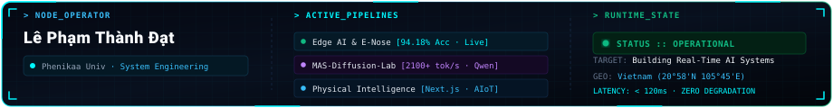
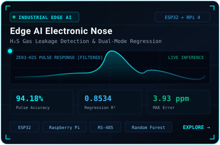
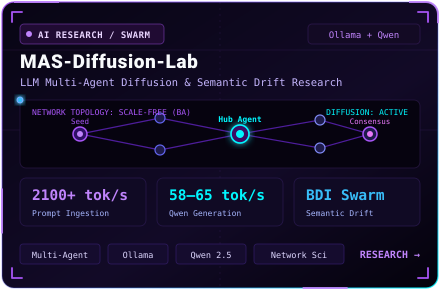
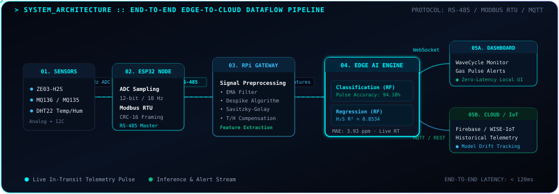

  

---

## System Status

---

## Featured Systems

 

<b>📂 Additional Systems &amp; Repositories</b>

 

| System | Focus | Stack | Link |
| :--- | :--- | :--- | :--- |
| **Sign Language Recognition** | Real-time sign language vision inference | `TensorFlow.js` `CNN` `Transfer Learning` | [Repository →](https://github.com/liliustwocout/Sign-Language-Recognition) |
| **DevShare Lite** | Developer knowledge-sharing platform | `Django` `React` `JWT` `SQLite` | [Repository →](https://github.com/liliustwocout/DevShare-Lite) |

---

## System Architecture

---

## Research Benchmarks

<table>
<tr>

<td align="center" width="25%">

### 94.18%

Pulse Classification Accuracy

</td>

<td align="center" width="25%">

### 0.8534

H₂S Regression R²

</td>

<td align="center" width="25%">

### 2100+

Tokens/s

Prompt Processing

</td>

<td align="center" width="25%">

### 58–65

Tokens/s

Qwen Generation

</td>

</tr>
</table>

---

## Technical Stack

  

---

## GitHub Analytics

  

  

---

## Connect

&nbsp;

&nbsp;

  

